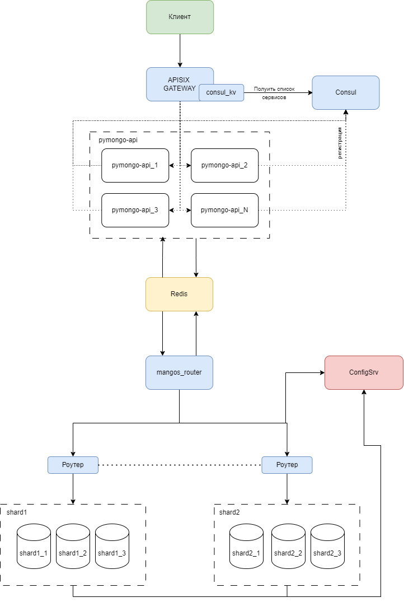

# Задание 1. Планирование 
Ссылка на диаграмму - [Диаграма](https://disk.yandex.ru/d/YMk2Uu1xHUrgpQ) 

# Задание 2. Шардирование

## Как запустить

Запускаем mongodb и приложение

```shell
cd ./mongo-sharding/ 
docker compose up -d

```

Запускаем процесс инициализации шардов и заполняем mongodb данными

```shell
./scripts/mongo-init.sh
```

# Задание 3. Репликация

## Как запустить

Запускаем mongodb и приложение

```shell
cd ./mongo-sharding-repl/ 
docker compose up -d

```

Запускаем процесс инициализации шардов и заполняем mongodb данными

```shell
./scripts/mongo-init.sh
```

# Задание 4. Кэширование

## Как запустить

Запускаем mongodb и приложение

```shell
cd ./sharding-repl-cache/ 
docker compose up -d

```

Запускаем процесс инициализации шардов и заполняем mongodb данными

```shell
./scripts/mongo-init.sh
```

# Задание 5. Service Discovery и балансировка с API Gateway

Ссылка на диаграмму - [Диаграма](https://disk.yandex.ru/d/YMk2Uu1xHUrgpQ)
